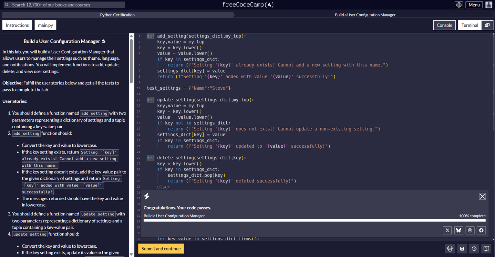
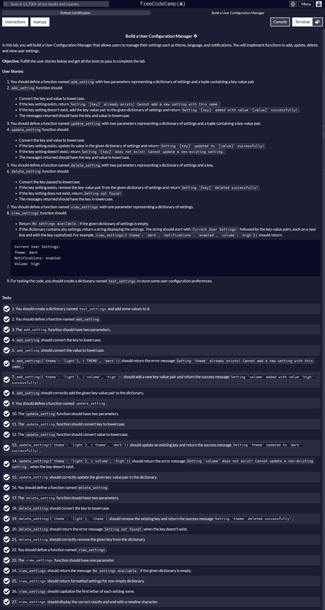

# 🛠️ User Configuration Manager

> A Python-based configuration management system developed as part of the **freeCodeCamp Scientific Computing with Python Certification**.

## 📖 Overview

The **User Configuration Manager** is a command-line Python application that manages user configuration settings such as themes, language preferences, notifications, and other customizable options.

The project demonstrates how Python dictionaries can be used to efficiently store and manipulate key-value pairs while implementing common CRUD (Create, Read, Update, Delete) operations.

---

## 🎯 Project Objective

The objective of this project was to build a configuration management system capable of:

- Adding new configuration settings
- Updating existing settings
- Deleting settings
- Viewing all saved settings
- Handling duplicate and invalid operations gracefully

---

## ✨ Features

- ➕ Add a new setting
- ✏️ Update an existing setting
- 🗑️ Delete a setting
- 📋 Display all stored settings
- 🔡 Automatic lowercase conversion for consistency
- ⚠️ Error handling for duplicate and non-existing settings
- 🧹 Clean and readable output formatting

---

## 📂 Project Structure

```text
User Configuration Manager/
│
├── README.md
├── User_Configuration_Manager.py
├── Code_Passes_Successfully.png
└── User_Configuration_Manager_Manual.png
```

---

## 🛠️ Technologies Used

- Python 3
- Git
- GitHub
- GitHub Codespaces
- VS Code

---

## 🧠 Concepts Covered

This project demonstrates the following Python concepts:

- Functions
- Dictionaries
- Tuples
- String Manipulation
- Conditional Statements
- CRUD Operations
- Data Validation
- Code Organization
- Basic Error Handling

---

## 🚀 How to Run

1. Clone the repository

```bash
git clone https://github.com/Satvik-Creations/freeCodeCamp-LAB-Projects.git
```

2. Navigate to the project folder

```bash
cd "User Configuration Manager"
```

3. Run the program

```bash
python User_Configuration_Manager.py
```

---

## 📸 Project Screenshot

The solution successfully passes all required freeCodeCamp tests.



---

## 📑 Project Instructions

The original project requirements and user stories are included below.



---

## ✅ Learning Outcomes

Through this project, I gained practical experience with:

- Designing reusable Python functions
- Working with mutable data structures
- Implementing dictionary-based data management
- Writing cleaner and maintainable Python code
- Handling edge cases and validation
- Following project specifications and passing automated tests

---

## 🎓 Certification

This project was completed as part of the **Scientific Computing with Python Certification** offered by **freeCodeCamp**.

---

## 👨‍💻 Author

**Satvik**

B.Tech CSE (Artificial Intelligence & Machine Learning) Student

Passionate about AI • Machine Learning • Python • Software Development

GitHub: https://github.com/Satvik-Creations
